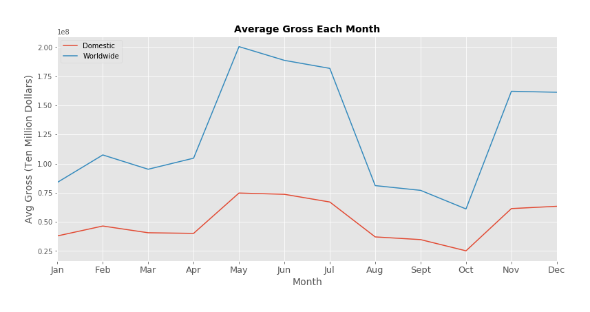
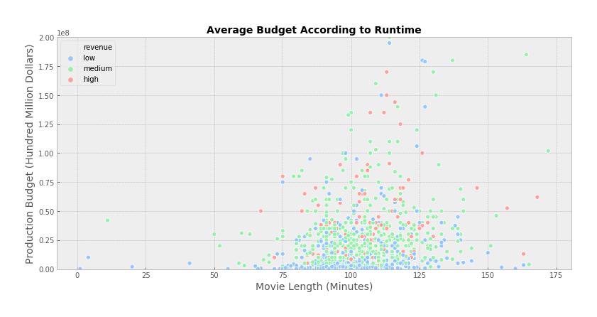

## Microsoft Movie Analysis

## Overview

This project analyzes the measurements of popularity for movies released in theaters in the past ten years, using data collected from [IMDB](imdb.com) and [theMovieDB](https://www.themoviedb.org/). Descriptive analysis of this data shows that movies should be release during the early summer or winter, with a budget ranging between 10 million and 75 million dollars. Additionally, the studio’s first films should be within the Music, Documentary, and Biography genres. Microsoft can use this analysis to open a movie production studio and successfully enter the industry.

## Business Problem

Microsoft has decided to create a new movie studio, and the company wants to gain a better understanding of the movie industry. The task is to explore what type of films succeed at the box office. Key findings should be translated to actionable insights that the head of Microsoft’s new movie studio can use to help decide what type of films to create.

**Business Questions:**
I will be investigating three main questions through exploratory data analysis.
1.	What time of the year are movies the most popular?
2.	What is an appropriate budget range for popular movies?
3.	What is the most popular movie genre?

## Data & Methods

This analysis performs descriptive analysis on the dataset `all_movies`, which was compiled from four subset files of data from the websites IMDB.com and theMovieDB.org. Each subset contained useful information about measures of popularity for movies. I cleaned the subsets before merging them to the dataframe `all_movies` and imported it into the final dataset to `final_analysis.ipynb` to use for analysis.

The data cleaning notebook can be found in this repository under the name `data_cleaning.ipynb` or click [here](https://github.com/sidneykung/Movie-Data-Analysis/blob/master/data_cleaning.ipynb). 

Subsets used can be found in the `zippedData` folder in this repository.
* IMDB.com
    * imdb.title.basics.csv.gz
    * imdb.title.ratings.csv.gz
* TheMovieDB.org
   * tmdb.movies.csv.gz
   * tn.movie_budgets.csv.gz

## Results

Among many other results, I found that movies earn the highest worldwide gross during the early summer, between April and July. There is also another ~146% increase spike between October and November.

Additionally, by analyzing the placement of low, medium, and high revenue movies on the ‘Average Budget According to Runtime’ graph, it can be understood that movies with runtimes less than an hour don’t make a high revenue. 

## Conclusions
-	**Release movies during the early summer and winter.** From April to July and October to November, there is a record of drastically increasing average domestic and worldwide gross.
-	**Expect a production budget between 10 million and 75 million dollars.** On average, this range has the highest Return on Investment (ROI).
-	**Microsoft Studio’s first films should be within the Music, Documentary, and Biography genres.** Across IMDB and theMovieDB, these genres have ranked the highest among user reviews.
-	**These first films should range between 75 and 125 minutes.** High revenue movies typically stayed in this range, with varying production budgets.

## Next Steps

Further analyses could yield additional insights on producing popular movies:
-	Webscraping data from **popular streaming services**, such as Netflix, could reveal whether theater release or streaming release is more profitable.
-	Additional data on each movie’s **gross in other specific countries** could provide clarification on why average domestic gross and average worldwide gross is parallel each month of the year.
-	This analysis included movie data from 2010-2020. Narrowing down to a closer look at the data from the last 5 years, or even expanding investigation to 20 years in the past could provide more information about **year-based trends**.
-	Webscraping review data with **written text reviews** could introduce the characteristics of each genre that general audiences like or dislike.

## For More Information

See the [full analysis](https://github.com/sidneykung/Movie-Data-Analysis/blob/master/final_analysis.ipynb) in a Jupyter Notebook, named `full_analysis.ipynb`, located in this repository.

For additional info, contact Sidney Kung at sidneyjkung@gmail.com

## Repository Contents

* `images`: folder with images used in README.md and 'final_analysis.ipynb'
* `visualizations`: folder with all generated visualizations from 'final_analysis.ipynb'
* `zippedData`: folder with subset files used in 'final_analysis.ipynb'
* `.gitignore`: file used to hide nonessential files
* `README.md`: text file that's previewed on github repository
* `all_movies_df.csv`: final dataframe that was created by merging and cleaning in 'data_cleaning.ipynb'
* `data_cleaning.ipynb`: notebook where subset data was merged and cleaned before saving to `all_movies_df.csv`
* `final_analysis.ipynb`: final notebook with full analysis
* `presentation.pdf`: 
